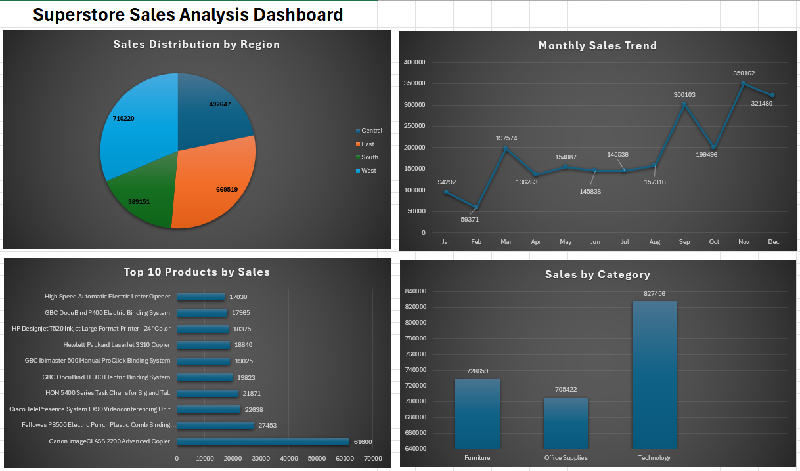

# Superstore Sales Analysis

## Project Overview
This project analyzes Superstore sales data using Microsoft Excel and Pivot Tables. The objective is to identify sales trends, regional performance, category-wise sales, and top-performing products.

## Tools Used
- Microsoft Excel
- Pivot Tables
- Pivot Charts
- Data Visualization

## Analysis Performed
- Sales Distribution by Region
- Monthly Sales Trend Analysis
- Sales by Category
- Top 10 Products by Sales
- Dashboard Creation

## Key Insights
- West region generated the highest sales.
- Technology category achieved the highest sales.
- Sales increased significantly during the last quarter.
- A small number of products contributed heavily to revenue.

## Author
Pala Prajwal
## Dashboard

